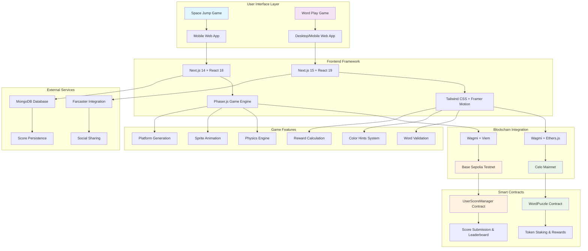
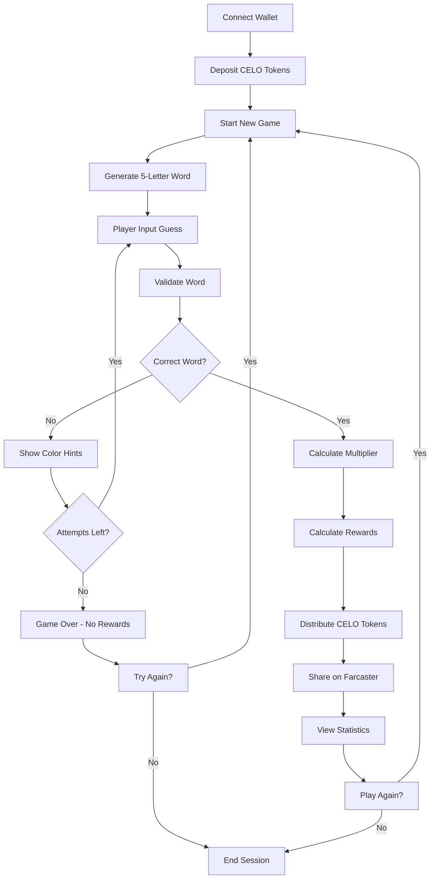
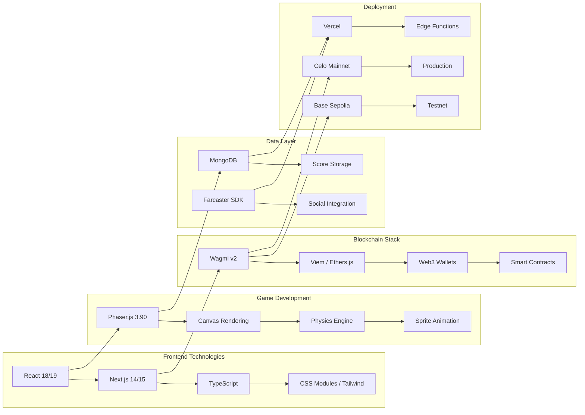
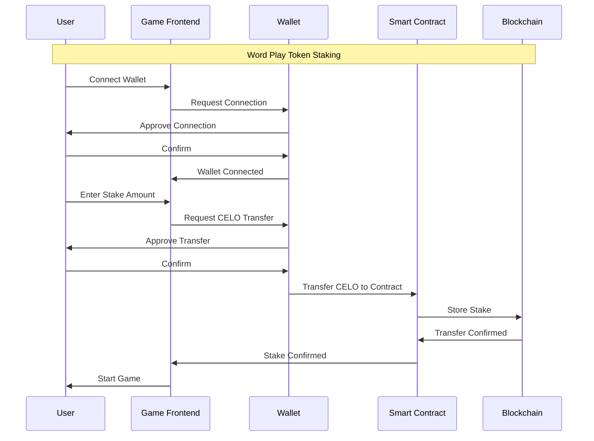
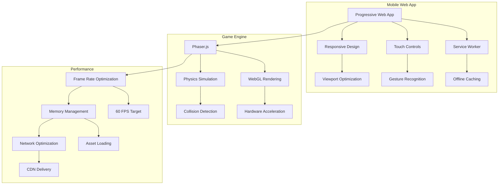

# 🚀 Celo Word Puzzle- Web3 Game

A blockchain-integrated game built on Farcaster with Next.js (a word guessing game with CELO token rewards).

## 🎮 Game Overview

A strategic word-guessing game where players stake CELO tokens to participate and earn rewards based on speed and accuracy.

**Key Features:**
- 💰 **CELO Token Integration**: Stake tokens to play and earn rewards
- 🎯 **Strategic Gameplay**: 5-letter word guessing with color-coded hints
- ⚡ **Speed Rewards**: Faster guesses = higher multipliers
- 🔗 **Farcaster Integration**: Social sharing capabilities
- 🏆 **On-Chain Rewards**: Deployed on Celo Mainnet
- 🎨 **Modern UI**: Built with React, Next.js, and Tailwind CSS

## 🛠 Tech Stack

### Word Play Game
- **Frontend**: Next.js 15, React 19, TypeScript
- **Blockchain**: Celo Mainnet, Wagmi, Ethers.js
- **Styling**: Tailwind CSS 4, Framer Motion
- **Wallet**: RainbowKit integration
- **Social**: Farcaster Frame SDK
- **Smart Contract**: Solidity (WordPuzzle.sol)

## 🚀 Quick Start

### Prerequisites
- Node.js 18+ 
- pnpm (recommended) or npm
- Web3 wallet (MetaMask, Rainbow, etc.)

### Installation

1. **Clone the repository**
   ```bash
   git clone https://github.com/yourusername/celo-word-puzzle.git
   ```

2. **Install dependencies for Space Jump**
   ```bash
   cd celojump
   pnpm install
   ```

3. **Install dependencies for Word Play**
   ```bash
   cd ../wordgame
   pnpm install
   ```

### Running the Games

#### Word Play Game
```bash
cd wordgame
pnpm dev
```
Open [http://localhost:3000](http://localhost:3000) in your browser.

## 🎯 How to Play

### Word Play Game
1. **Connect Wallet**: Connect your Web3 wallet
2. **Deposit CELO**: Stake CELO tokens to start playing
3. **Guess the Word**: You'll get a 5-letter word to guess
4. **Color Hints**:
   - 🟩 Green: Correct letter in correct position
   - 🟨 Yellow: Correct letter in wrong position
5. **Earn Rewards**: Faster guesses = higher multipliers
6. **Share**: Share your victory on Farcaster

## 🔗 Blockchain Integration

### Space Jump - Base Sepolia
- **Contract**: UserScoreManager
- **Address**: `0xf21de389278EAf3aC631e1327712F70949BAb150`
- **Network**: Base Sepolia Testnet
- **Features**: Score submission, leaderboard, personal stats

### Word Play - Celo Mainnet
- **Contract**: WordPuzzle
- **Address**: `0x1daBC80337bF2d85d496c4eD9cE63a1b16Fbd539`
- **Network**: Celo Mainnet
- **Features**: Token staking, reward distribution, game state management


# Celo Word Puzzle- Architecture Diagram

## System Architecture Overview



### Word Play Game Flow


## Technology Stack Diagram


## Smart Contract Integration


## Mobile Architecture


This comprehensive architecture diagram shows:

1. **System Overview**: The overall structure of both games and their components
2. **Game Flows**: Step-by-step user interactions for both games
3. **Technology Stack**: All the technologies used in the project
4. **Smart Contract Integration**: How the games interact with blockchain
5. **Mobile Architecture**: Mobile-specific optimizations and features

The diagrams illustrate how your celo word puzzle project integrates Web3 technologies with traditional game development to create engaging blockchain-based gaming experiences.


## 📱 Mobile Support

Both games are fully optimized for mobile devices:
- **Responsive Design**: Works on all screen sizes
- **Touch Controls**: Optimized for mobile interaction
- **PWA Support**: Can be installed as mobile apps
- **Portrait Orientation**: Locked for optimal mobile experience

## 🏗 Project Structure

```
jump-jump-jump/
├── celojump/                 # Space Jump Game
│   ├── app/                  # Next.js app directory
│   ├── components/           # React components
│   ├── assets/              # Game assets (sprites, sounds)
│   ├── smartcontracthooks/  # Blockchain integration hooks
│   ├── lib/                 # Utilities and constants
│   └── game.js              # Core game logic
├── wordgame/                # Word Play Game
│   ├── src/
│   │   ├── app/             # Next.js app directory
│   │   ├── components/      # React components
│   │   ├── context/         # React context providers
│   │   └── utils/           # Utility functions
│   └── contracts/           # Solidity smart contracts
└── README.md               # This file
```

## 🎨 Assets

### Space Jump Assets
- `astronaut.png` - 4-frame sprite sheet (952x238)
- `bg.png`, `bg2.png` - Background images
- `tilePurple.png`, `tileRed.png`, `tileYellow.png` - Platform sprites
- `coin.png` - Collectible items
- `jump.wav`, `coins.mp3` - Sound effects

### Word Play Assets
- Custom fonts and icons
- Responsive UI components
- Animated transitions

## 🔧 Development

### Available Scripts

#### Space Jump
- `pnpm dev` - Start development server
- `pnpm build` - Build for production
- `pnpm start` - Start production server
- `pnpm lint` - Run ESLint

#### Word Play
- `pnpm dev` - Start development server
- `pnpm build` - Build for production
- `pnpm start` - Start production server
- `pnpm lint` - Run ESLint

### Environment Variables

Create `.env.local` files in each game directory with the required environment variables for blockchain integration.

## 🚀 Deployment

### Space Jump
- Deployed on Vercel/Netlify
- Base Sepolia testnet integration
- MongoDB for score persistence

### Word Play
- Deployed on Vercel/Netlify
- Celo Mainnet integration
- Smart contract deployed and verified

## 🤝 Contributing

1. Fork the repository
2. Create a feature branch (`git checkout -b feature/amazing-feature`)
3. Commit your changes (`git commit -m 'Add some amazing feature'`)
4. Push to the branch (`git push origin feature/amazing-feature`)
5. Open a Pull Request

## 🙏 Acknowledgments

- **Phaser.js** for the game engine
- **Farcaster** for social integration
- **Celo** and **Base** for blockchain infrastructure
- **Next.js** and **React** for the web framework
- **Tailwind CSS** for styling

## Check
- **Farcaster Mini App Link:** https://farcaster.xyz/miniapps/vpxzhkMpuBnT/celo-word-puzzle
- **Deployment Link:** https://celo-word-puzzle.vercel.app/
- **Project Link**: [https://github.com/yourusername/jump-jump-jump](https://github.com/yourusername/jump-jump-jump)
- **Word Play Contract**: [Celo Explorer](https://celoscan.io/address/0x1daBC80337bF2d85d496c4eD9cE63a1b16Fbd539)

---

**Ready to jump into Web3 gaming? Start playing now! 🎮✨**
