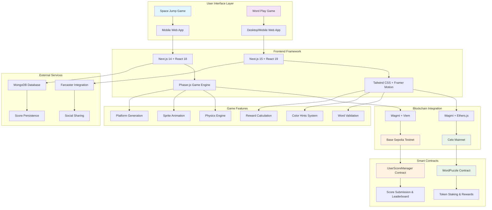
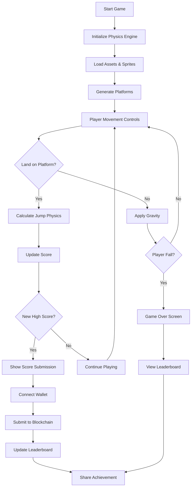
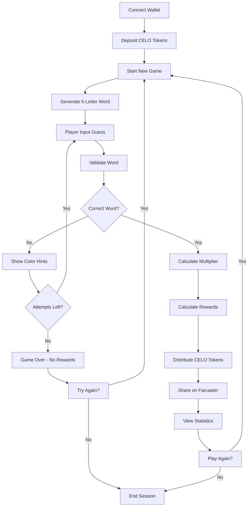
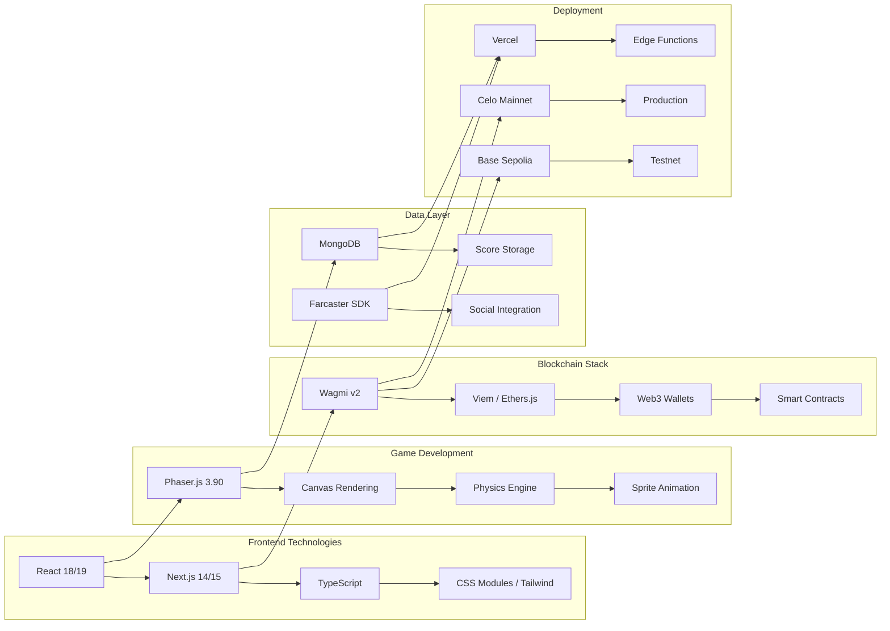
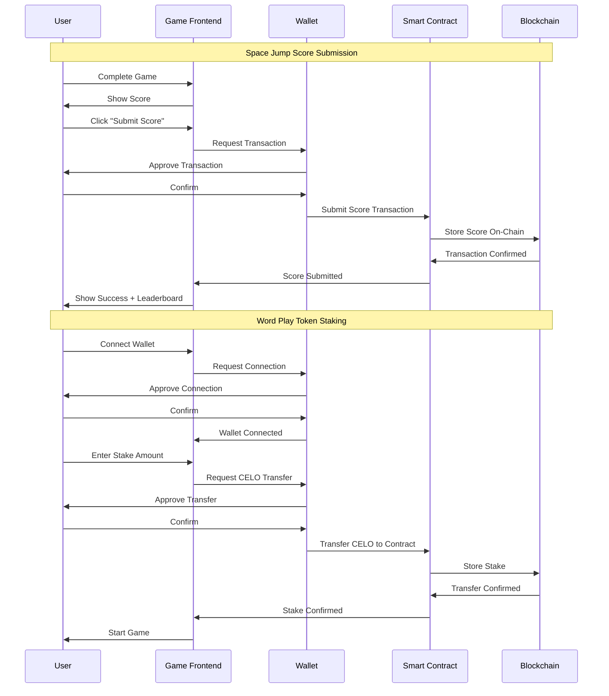
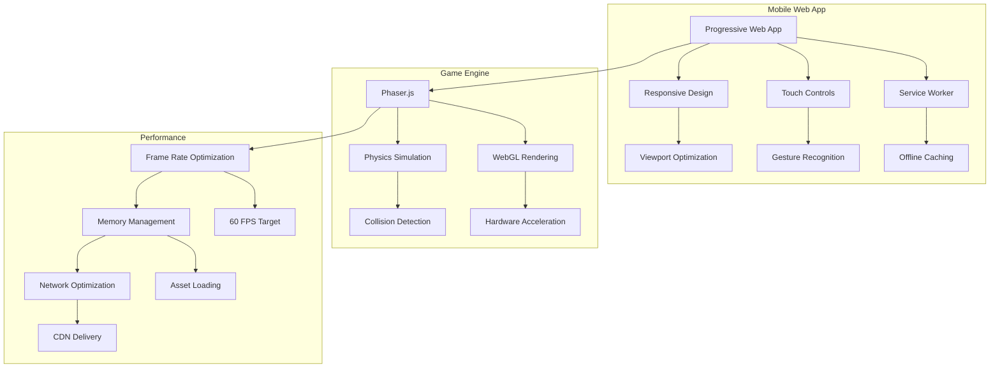

# Jump-Jump-Jump - Architecture Diagram

## System Architecture Overview

## Game Flow Diagrams

### Space Jump Game Flow

### Word Play Game Flow

## Technology Stack Diagram

## Smart Contract Integration

## Mobile Architecture

This comprehensive architecture diagram shows:

1. **System Overview**: The overall structure of both games and their components
2. **Game Flows**: Step-by-step user interactions for both games
3. **Technology Stack**: All the technologies used in the project
4. **Smart Contract Integration**: How the games interact with blockchain
5. **Mobile Architecture**: Mobile-specific optimizations and features

The diagrams illustrate how your Jump-Jump-Jump project integrates Web3 technologies with traditional game development to create engaging blockchain-based gaming experiences.
